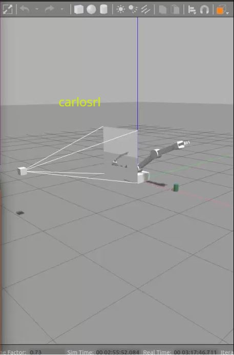
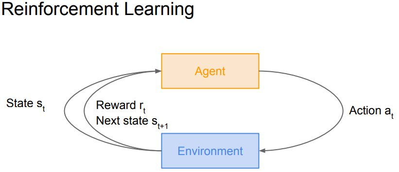
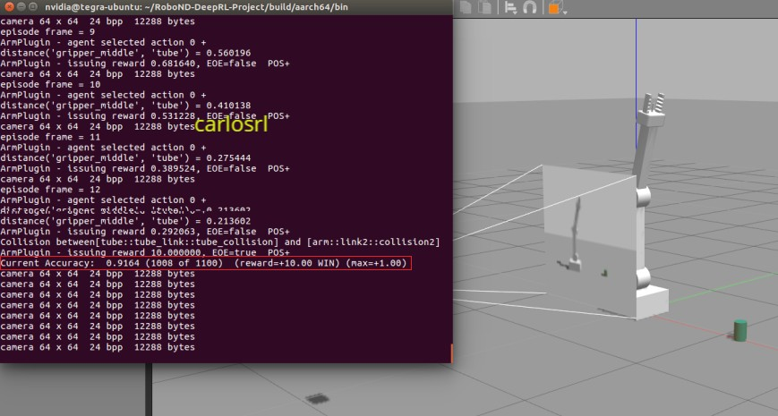
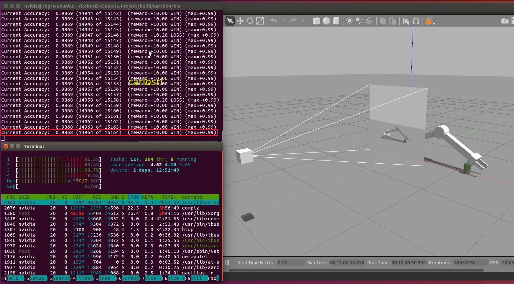

# Deep RL Arm Manipulation

### Autor: Carlos Lacerda



Fig. 1 - Deep RL applied to robotic arm.

The target of this project is to create a DQN agent and define reward functions to teach a robotic arm to carry out two primary objectives:
1. Have any part of the robot arm touch the object of interest, with at least a 90% accuracy.
2. Have only the gripper base of the robot arm ouch the object, with at least a 80% accuracy.

The Gazebo environment train a robotic arm to touch an object without needing explicit IK (Inverse Kinematics). If you want to see IK being used to move a robotic arm, you can check my IK project [here](https://github.com/zenetio/RoboND-Kinematics-Project).

This project is based on the Nvidia open source project "jetson-reinforcement" developed by [Dustin Franklin](https://github.com/dusty-nv).

## Hardware
- Nvidia Jetson TX2

## Software
- ROS Kinetic
- Gazebo

## Deep Reinforcement Learning (DRL)


Fig. 2 - Reinforcement Learning

RL is generally used to solve the so-called Markov decision problem (MDP). In other words, the problem that you are attempting to solve with RL  hould be an MDP or its variant. The theory of RL relies on dynamic  rogramming (DP) and artificial intelligence (AI).

During the learning process, the feedback signals that tell us how well we do are things like yes, no or correct, wrong or win, loss. And, depending on the feedback, we receive a reward.

In a reinforcement learning problem, we take the view of an agent that tries to maximize the reward that it is receiving from making decisions.

Thus an agent that receives the maximum possible reward can be viewed as performing the best action for a given state. An agent here refers to an abstract entity which can be any kind of object or subject that performs actions: autonomous cars, robots, humans, customer support chat bots, go players. The state of an agent refers to the agent’s position and state of being in it’s abstract environment; for example, a certain position in a virtual reality world, a building, a chess board, or the position and speed on a racetrack.

## The Value Function

Reinforcement learning is about positive and negative rewards (punishment) and learning to choose the actions which yield the best cumulative reward. To find these actions, it’s useful to first think about the most valuable states in environment. The goal is to move from state S (Start) to state G (Goal). The final solution can be tuned by altering the reward values.

## Discounting Factor
Even though the value function handles competing rewards, it also depends on a parameter called the discounting factor that defines its exact behavior by limiting how much an agent is affected by rewards which lie in the far future. This is done by multiplying the partial reward by the discounting factor whenever a state change is made. So with a discounting factor of 0.5, the original reward will be one eighth of its value after only 3 state changes, causing the agent to pursue rewards in close proximity rather than rewards which are further away. Thus the discounting factor is a weight that controls whether the value function favors prudent or greedy actions.

## The Policy Function
The policy function represents a strategy that, given the value function, selects the action believed to yield the highest (long-term) reward. Often there is no clear winner among the possible next actions.

## Deep Q-learning
In this project we input the current point of view of the camera—an image—into a convolutional neural network (CNN) trained to predict the rewards for the next possible actions. Because images for similar states are similar (many left turns look similar) they will also have similar actions. For example, a neural network will be able to generalize for many increase position on an arm link and even make appropriate actions for increase position that were not encountered before. Just like a CNN trained on many different objects in images can learn to correctly distinguish these objects, a network trained on many similar variations of increase position will be able to make fine adjustments of velocity and position for each different increase position it is presented.

To use deep Q-learning successfully, however, we cannot simply apply the rule to train the Q-function. If we apply the Q-learning rule blindly, then the network will learn to do good increase position while doing increase position, but will start forgetting how to do good decrease position at the same time. This is so because all actions of the neural network use the same weights; tuning the weights for increase position makes them worse for other situations. The solution is to store all the input images and the output actions as “experiences”: that is, store the state, action and reward together.

After running the training algorithm for a while, we choose a random selection from all the experiences gathered so far and create an average update for neural network weights which maximizes Q-values (rewards) for all actions taken during those experiences. This way we can teach our neural network to do increase and decrease position at the same time. Since very early experiences of moving the arm to target are not important—because they come from a time where our agent was less experienced, or even a beginner—we only keep track of a fixed number of past experiences and forget the rest. This process is termed experience replay.

## The project simulation environment

As we can see in Fig. 1, the environment has a robotic arm, a tube in the ground and a camera that register the arm motion. 
- Task 1, have any part of the robot arm touch the object of interest, with at least a 90% accuracy.
- Task 2, have only the gripper base of the robot arm ouch the object, with at least a 80% accuracy.


## Task 1 ( accuracy target: 90% ) ##
In this task, both link arm and gripper will increase reward value to history reward.

For this task, the following Parameters Table was managed to optimize the model.

| Hyperparameters   | Value    | Reason |
| --------------|:--------:|:------ |
| Velocity Control | false | The position control worked very well
| LOCKBASE | true | Using DOF = 2
| EPS_DECAY | 1000 | Original value worked fine
| INPUT_WIDTH | 64 | 512 was causing memory issues. Changed to 64
| INPUT_HEIGHT | 64 | 512 was causing memory issues. Changed to 64
| BATCH_SIZE | 16   | Changed from 8 to 16 to improve feature quality
| LSTM_SIZE | 32    | Original value
| REWARD_WIN | 10.0f | Value defined for win
| REWARD_LOSS | -10.02f | Value defined for loss
| LEARNING_RATE | 0.01f | Suggested value
| REPLAY_MEMORY | 10000 | Original value

The robotic arm in this project has 3 DOF: base, joint 1 and joint 2. The code has the `LOCKBASE` condition where we can select to use 2 or 3 DOF. For each DOF we have two actions: increase or decrease. To refer the actions on each joint we use the following map:

| State Angle  | Action    | Description |
| --------------|:--------:|:------ |
| EVEN | increase | Increase the joint angle value
| ODD | decrease | Decrease the joint angle value

For instance, suppose the agent receives the state: joint 1, even. It means that the agent must send the action: increase joint 1 in `x` value.
```c++
#if LOCKBASE
    enum catchAction
    {
        joint1_even   = 0,
        joint1_odd,
        joint2_even,
        joint2_odd,
        NUM_ACTIONS
    };
#else
    enum catchAction
    {
        base_even = 0,
        base_odd,
        joint1_even,
        joint1_odd,
        joint2_even,
        joint2_odd,
        NUM_ACTIONS
    };
#endif
```
### The reward functions
The following functions where used in `task 1` to manage reward depending on the state received.
1. **onCollisionMsg()** - Here, both link arm or gripper collision are valid to get positive reward. So, the collision filter refuses only ground collision. See the snippet code below:
```C++
if( strcmp(contacts->contact(i).collision2().c_str(), COLLISION_FILTER) == 0 )
    continue;

if(DEBUG){std::cout << "Collision between[" << contacts->contact(i).collision1()
    << "] and [" << contacts->contact(i).collision2() << "]\n";}

// Check if there is collision between the arm and object, then issue learning reward
bool collisionCheck = true;
if (collisionCheck)
{
    rewardHistory = REWARD_WIN;
    newReward  = true;
    endEpisode = true;
    return;
}
```
2. **OnUpdate()** - Here, the function checks different scenarios to manage the reward history. 
- If number of episodes exceed the limit, the agent receives a loss.
```C++
if( maxEpisodeLength > 0 && episodeFrames > maxEpisodeLength )
{
    printf("ArmPlugin - triggering EOE, episode has exceeded %i frames\n", maxEpisodeLength);
    rewardHistory = REWARD_LOSS;
    newReward     = true;
    endEpisode    = true;
}
 ```
- Ìf there is a collision with ground, the agent receives a loss.
```C++
if(checkGroundContact)
{
    if(DEBUG){printf("GROUND CONTACT, EOE\n");}

    rewardHistory = REWARD_LOSS;
    newReward     = true;
    endEpisode    = true;
}
```
- If none collision is verified, the distance to goal is calculated and a reward is given. The calculation is done using a reward function based on the smoothed moving average of the delta of the distance to the goal. The tunning was done changing the value of alpha until have the arm move a bit quick when far from the target and then smoothly when near the target. See the snippet code below.
```C++
const float alpha = 0.447;
const float distDelta = lastGoalDistance - distGoal;
avgGoalDelta = avgGoalDelta*alpha + distGoal*(1.0 - alpha);
rewardHistory = avgGoalDelta;
newReward = true;
```
When running the script file, we see the following terminal output

```h
ArmPlugin::ArmPlugin()
ArmPlugin::Load('arm')
PropPlugin::Load('tube')
[deepRL]  use_cuda:       True
[deepRL]  use_lstm:       1
[deepRL]  lstm_size:      32
[deepRL]  input_width:    64
[deepRL]  input_height:   64
[deepRL]  input_channels: 3
[deepRL]  num_actions:    4
[deepRL]  optimizer:      RMSprop
[deepRL]  learning rate:  0.01
[deepRL]  replay_memory:  10000
[deepRL]  batch_size:     16
[deepRL]  gamma:          0.9
[deepRL]  epsilon_start:  0.9
[deepRL]  epsilon_end:    0.05
[deepRL]  epsilon_decay:  1000.0
[deepRL]  allow_random:   1
[deepRL]  debug_mode:     0
[deepRL]  creating DQN model instance
[deepRL]  DRQN::__init__()
[deepRL]  LSTM (hx, cx) size = 64
[deepRL]  DQN model instance created
[deepRL]  DQN script done init
[cuda]  cudaAllocMapped 3145728 bytes, CPU 0x101340000 GPU 0x101340000
[deepRL]  pyTorch THCState  0x44F5F310
[cuda]  cudaAllocMapped 12288 bytes, CPU 0x101640000 GPU 0x101640000
ArmPlugin - allocated camera img buffer 64x64  24 bpp  12288 bytes
camera 64 x 64  24 bpp  12288 bytes
episode frame = 1
ArmPlugin - agent selected action 3 -
distance('gripper_middle', 'tube') = 1.879032
camera 64 x 64  24 bpp  12288 bytes
episode frame = 2
ArmPlugin - agent selected action 0 +
distance('gripper_middle', 'tube') = 1.743709
ArmPlugin - issuing reward 1.220597, EOE=false  POS+
camera 64 x 64  24 bpp  12288 bytes
episode frame = 3
ArmPlugin - agent selected action 3 -
distance('gripper_middle', 'tube') = 1.816997
ArmPlugin - issuing reward 1.638077, EOE=false  POS+
camera 64 x 64  24 bpp  12288 bytes
episode frame = 4
ArmPlugin - agent selected action 2 +
distance('gripper_middle', 'tube') = 1.743703
ArmPlugin - issuing reward 1.712015, EOE=false  POS+
camera 64 x 64  24 bpp  12288 bytes
...
episode frame = 101
ArmPlugin - agent selected action 0 +
ArmPlugin - triggering EOE, episode has exceeded 100 frames
ArmPlugin - issuing reward -0.000000, EOE=true         ZERO
Current Accuracy:  0.0000 (000 of 001)  (reward=-0.00 LOSS)
```
## Task 2 ( accuracy target: 80% ) ##
In this task, only gripper will increase reward value to history reward.

For this task, the following Parameters Table was managed to optimize the model.

| Hyperparameters  | Value    | Reason |
| --------------|:--------:|:------ |
| Velocity Control | false | The position control worked very well
| LOCKBASE | true | Using DOF = 2
| EPS_DECAY | 10 | Changed from 1000 to 10
| INPUT_WIDTH | 64 | 512 was causing memory issues. Changed to 64
| INPUT_HEIGHT | 64 | 512 was causing memory issues. Changed to 64
| BATCH_SIZE | 32   | Changed from 16 to 32 to improve feature quality
| LSTM_SIZE | 256  | Changed from 64 to 256 to improve experience replay
| REWARD_WIN | 10.0f | Value defined for win
| REWARD_LOSS | -10.0f | Value defined for loss
| LEARNING_RATE | 0.01f | Suggested value
| REPLAY_MEMORY | 10000 | Original value

### The reward functions
In `task 2` we have the same reward functions used in `task 1` but with some differences to filter out some not desired collisions and improve the dqn convergence.
The following functions manage the reward depending on the state received.
1. **onCollisionMsg()** - Here, different from `task 1`, only gripper collision is valid to get positive reward. See the snippet code below:

```C++
if( strcmp(contacts->contact(i).collision2().c_str(), COLLISION_FILTER) == 0 )
    continue;

if(DEBUG){std::cout << "Collision between[" << contacts->contact(i).collision1()
    << "] and [" << contacts->contact(i).collision2() << "]\n";}

// Check if there is collision between the arm and object, then issue learning reward
bool collisionCheck = false;
if((strcmp(contacts->contact(i).collision1().c_str(), COLLISION_ITEM) == 0) && 
        (strcmp(contacts->contact(i).collision2().c_str(), COLLISION_POINT) == 0) )
    collisionCheck = true;
if (collisionCheck)
{
    rewardHistory = REWARD_WIN;
    newReward  = true;
    endEpisode = true;
    return;
}
```
2. **OnUpdate()** - Here, the function checks different scenarios to manage the reward history.
- If number of episodes exceed the limit, the agent receives a loss.  The same as in `task 1`.
```C++
if( maxEpisodeLength > 0 && episodeFrames > maxEpisodeLength )
{
    printf("ArmPlugin - triggering EOE, episode has exceeded %i frames\n", maxEpisodeLength);
    rewardHistory = REWARD_LOSS;
    newReward     = true;
    endEpisode    = true;
}
 ```
- Ìf there is a collision with ground, the agent receives a loss.  The same as in `task 1`.
```C++
if(checkGroundContact)
{
    if(DEBUG){printf("GROUND CONTACT, EOE\n");}

    rewardHistory = REWARD_LOSS;
    newReward     = true;
    endEpisode    = true;
}
```
- Here the reward function is a bit different from `task 1`. The calculation is done using a reward function based on the smoothed moving average of the delta of the distance to the goal. The tunning was done changing the value of alpha until have the arm move a bit quick when far from the target and then smoothly when near the target. Note that now instead of use `distGoal` the equation uses `distDelta`. This approach showed to improve the smooth movement of the arm resulting on a better colision precision, accelerating the convergence to optimal value. See the snippet code below.
```C++
const float alpha = 0.41;
const float distDelta = lastGoalDistance - distGoal;
avgGoalDelta = avgGoalDelta*alpha + distDelta*(1.0 - alpha);
rewardHistory = avgGoalDelta;
newReward = true;
```
Note the reward function is based on delta distance between previous and current distance from gripper to tube.

When running the script file, we see the following terminal output

```h
mArmPlugin::ArmPlugin()
ArmPlugin::Load('arm')
PropPlugin::Load('tube')
[deepRL]  use_cuda:       True
[deepRL]  use_lstm:       1
[deepRL]  lstm_size:      256
[deepRL]  input_width:    64
[deepRL]  input_height:   64
[deepRL]  input_channels: 3
[deepRL]  num_actions:    4
[deepRL]  optimizer:      RMSprop
[deepRL]  learning rate:  0.01
[deepRL]  replay_memory:  10000
[deepRL]  batch_size:     32
[deepRL]  gamma:          0.9
[deepRL]  epsilon_start:  0.9
[deepRL]  epsilon_end:    0.05
[deepRL]  epsilon_decay:  10.0
[deepRL]  allow_random:   1
[deepRL]  debug_mode:     0
[deepRL]  creating DQN model instance
[deepRL]  DRQN::__init__()
[deepRL]  LSTM (hx, cx) size = 256
[deepRL]  DQN model instance created
[deepRL]  DQN script done init
[cuda]  cudaAllocMapped 49152 bytes, CPU 0x101340000 GPU 0x101340000
[deepRL]  pyTorch THCState  0x44E02630
[cuda]  cudaAllocMapped 12288 bytes, CPU 0x101540000 GPU 0x101540000
ArmPlugin - allocated camera img buffer 64x64  24 bpp  12288 bytes
[deepRL]  nn.Conv2d() output size = 800
ArmPlugin - triggering EOE, episode has exceeded 100 frames
Current Accuracy:  0.0000 (000 of 001)  (reward=-10.20 LOSS) (max=+0.00)
Current Accuracy:  0.0000 (000 of 002)  (reward=-10.20 LOSS) (max=+0.00)
Current Accuracy:  0.0000 (000 of 003)  (reward=-10.20 LOSS) (max=+0.00)
Current Accuracy:  0.0000 (000 of 004)  (reward=-10.20 LOSS) (max=+0.00)
Current Accuracy:  0.0000 (000 of 005)  (reward=-10.20 LOSS) (max=+0.00)
Current Accuracy:  0.1667 (001 of 006)  (reward=+10.00 WIN) (max=+0.17)
Current Accuracy:  0.1429 (001 of 007)  (reward=-10.20 LOSS) (max=+0.17)
Current Accuracy:  0.1250 (001 of 008)  (reward=-10.20 LOSS) (max=+0.17)
ArmPlugin - triggering EOE, episode has exceeded 100 frames
```
## Results

Task 1 accuracy: `91.2%` - Task 2 accuracy: `98.6%`

The table 3 shows the comparison between parameters used in task 1 and task 2.

| Hyperparameters  | Task 1  |Task 2  | Results |
| --------------|:-------|:------|:------ |
| Velocity Control | false |false | position control facilitate the robot arm control
| LOCKBASE | true | true | DOF = 3 caused gripper to became uninstable
| EPS_DECAY | 1000 | 10 | Original value worked fine only for task 1.
| INPUT_WIDTH | 64 | 64 | fixed memory issues and execution time was improved.
| INPUT_HEIGHT | 64 | 64 | fixed memory issues and execution time was improved.
| BATCH_SIZE | 16 | 32 | improved feature quality
| LSTM_SIZE | 32 | 256 | increasing greatly stabilizes and improves the DQN training procedure.
| REWARD_WIN | 10.0f | 10.0f | Value defined for win
| REWARD_LOSS | -10.0f | -10.0f | Value defined for loss
| LEARNING_RATE | 0.01f | 0.01f | Suggested value
| REPLAY_MEMORY | 10000 | 10000 | Original value

1. In both tasks, this project used the `position control` that showed to be more efficient to control the arm than `velocity control`.
2. Because LOCKBASE is true, both tasks use DOF, which means the arm base is locked, allowing only jont1 and joint 2 to be used.
3. Decreasing the input size from 512 to 64 fixed a memory issue that was causing the program to hang. In addition, the execution time was decreased.
4. The increase of LSTM_SIZE improved good DQN stability facilitating the training procedure.


Fig. 3 - Task 1 reached 91% accuracy.


Fig. 4 - Task 2 reached 98% accuracy.

The Fig. 3 shows 91% accuracy for Task 1 and Fig. 4 shows 98% accuracy for Task 2.

Even task2 being more complex thant task1, the Table 3 shows that the way how parameters where managed, provided a good improvement in the accuracy.

Use 3 DOF was not possible because, by some reason, the gripper becames uninstable which invalidades any try to complete a unique Episode.
## Future work

One suggestion for future work is to improve the code to make the arm move the tube from position A to B and then move back from B to A. This is a much more complex task because the agent must try to maximize a more precise position than the one managed in task 1 and 2.


